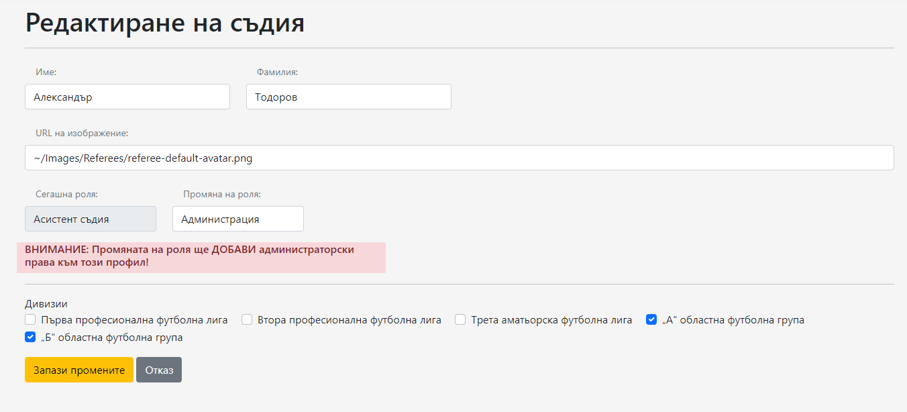
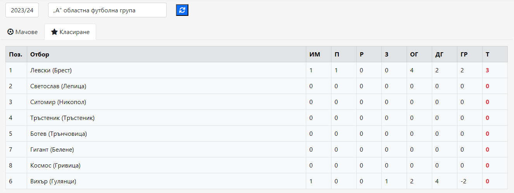

# FootballRefereeManagementSystem
 **Football Referee Management System** is my final project for completing the ASP.NET Core Advanced course at Software University. The application is designed for exclusive use by selected individuals (referees), with registration being limited and requiring a personal registration link. The system allows for online tracking of an entire football season, including lower divisions in the Bulgarian football structure. Each football match has a referee squad consisting of four people, each with a specific role. Referees (users) can track their assigned matches, record match results, and confirm match completion. The schedule for matches is created and maintained by administrators (users in the "Admin" role).
## Application Flow
### Guest
When the application is started, guests are redirected to the home page, where a navigation menu allows registered users to log in to their personal accounts.

To register, guests can create a "career application" from the Career menu option.

Another application functionality they can use is the Contact option to send a message.

Once a career application is submitted and approved by an administrator, an email is sent to the applicant's email address with a personal link for registering a new account.

### User
After successful login, users are redirected to the user home page. Here, they can use the "Status" button to indicate their availability or busyness for referee squads. The page also displays assigned match counts, general season information, and personal referee information and statistics. The navigation menu includes options for News, Referees, Season, Weekly schedule, Profile, and Exit.

User can also have read-only access "News" page. Admins have additional buttons to "Add", "Edit" and "Delete" articles.

Same user/admin access for the "Referees" page where all registered users are listed.

The referee edit page allows admin to change the names, image, role or divisions in which referee is allowed to officiate. Changing the role to admin gives admin access to that user. Changing it to something other than admin and the admin access will be revoked.

Season page displays a typical structured page for football-related applications where one tab lists all matches which are going to be played during selected season. The other tab displays the leaderboard for selected division.

Clicking on the information button for each match brings you into match details page where you get all match information and previous matches played between those two teams.

Each team name is button which routes to said team’s detailed information. The page displays best position achieved by the team as well as in which season. Shows match history and full player list for the selected season.

The schedule page displays currently assigned referee squads which have an upcoming match. Only users who are part of the squad and admins can enter the match center for that.

In his profile management pages a user can change his personal data, email change, password change or option to download/delete his personal data from the application.

### Admin
Admins have access to an "Admin panel" where they control the application. The dashboard provides current season information, and the panel includes navigation for managing applications, divisions, towns, zones, teams, and players.

Admins can also create schedules for referees and assign referee squads to matches. Only matches within that same calendar week are available for the admins to assign referee squad.

To create a referee squad the admin needs to select 4 squad members each with their specific role. The dropdown menus allow admin to pick from list of admins who are allowed to officiate in division matching that of the match itself as well as actually filling that role.

After match is assigned the users in that specific squad access the team match center where they can see the full list of squad members with their contacts and send them messages. Detailed match information is also displayed. After the match has been finished any member of the squad can fill the final score and press on the “Finish match” button in order to submit it to the system. That button triggers calculations according to the result and winner of the match is awarded 3 points. If there is a draw each team receives only 1 point. The season standings table is then adjusted. Referee officiated matches count is also adjusted. This completes the circle of the application and its current functionality.

## Application Setup

To start the application, follow these steps:

1. Clone the git repository.
2. Add a connection string to the database.
3. Register on [SendGrid](https://sendgrid.com/) to obtain an API key. Add the key as "EmailSettings: ApiKey: {your personal API key}" in appsettings.json or secrets.json.
4. The application will automatically seed the admin role along with one initial user assigned that role.

## Tech Stack

- ASP.NET Core 6.0
- SendGrid version "9.28.1"
- Microsoft.AspNetCore.Identity version "6.0.20"
- EntityFrameworkCore version "6.0.18"
- NUnit version "3.13.3"

**Database:** MS SQL Server

**Entities Relational Diagram:**

**Tools:**
- GitHub
- Git

## License

This project is licensed under the [MIT License](./LICENSE).

## Acknowledgements

I would like to express my gratitude to Software University for providing the ASP.NET Core Advanced course, which served as the foundation for this project.
